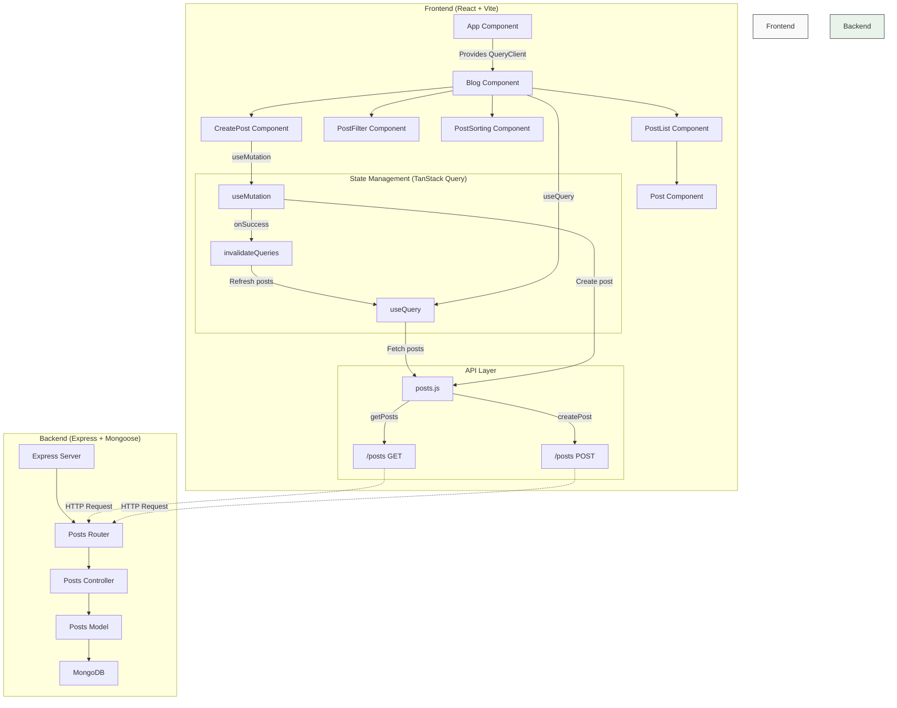

```mermaid
flowchart TD
    subgraph "Frontend (React + Vite)"
        A[App Component] --> |Provides QueryClient| B[Blog Component]
        B --> C1[CreatePost Component]
        B --> C2[PostFilter Component]
        B --> C3[PostSorting Component]
        B --> C4[PostList Component]
        C4 --> C5[Post Component]
        
        subgraph "API Layer"
            D1[posts.js]
            D1 -->|getPosts| D2["/posts" GET]
            D1 -->|createPost| D3["/posts" POST]
        end
        
        subgraph "State Management (TanStack Query)"
            E1[useQuery] --> |Fetch posts| D1
            E2[useMutation] --> |Create post| D1
            E3[invalidateQueries] --> |Refresh posts| E1
        end
        
        C1 --> |useMutation| E2
        B --> |useQuery| E1
        E2 --> |onSuccess| E3
    end
    
    subgraph "Backend (Express + Mongoose)"
        F[Express Server] --> G1[Posts Router]
        G1 --> G2[Posts Controller]
        G2 --> G3[Posts Model]
        G3 --> H[MongoDB]
    end
    
    D2 -.-> |HTTP Request| G1
    D3 -.-> |HTTP Request| G1
    
    style Frontend fill:#f9f9f9,stroke:#333,stroke-width:1px
    style Backend fill:#e8f4ea,stroke:#333,stroke-width:1px
```
