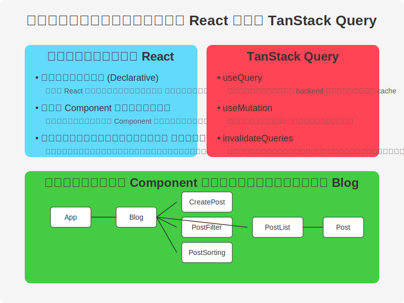
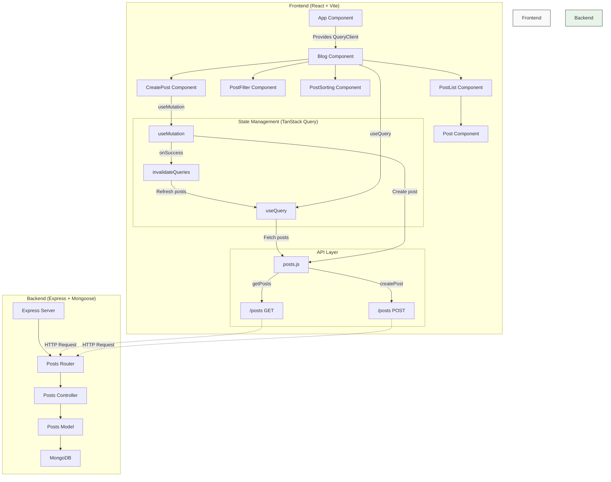

# การพัฒนาแอปสร้างบล็อคด้วย React และ TanStack Query โดยใช้คอนเทนเนอร์ 
## CR: Modern Full-Stack React Projects 
https://github.com/PacktPublishing/Modern-Full-Stack-React-Projects.git

## ภาพรวม


# TanStack Query คืออะไร?

TanStack Query (หรือที่เคยรู้จักในชื่อ React Query) เป็นไลบรารีจัดการสถานะ (state management library) ที่ออกแบบมาเฉพาะสำหรับการจัดการข้อมูลที่มาจากเซิร์ฟเวอร์ในแอปพลิเคชัน JavaScript โดยเน้นไปที่การดึงข้อมูล การแคช และการซิงโครไนซ์สถานะของเซิร์ฟเวอร์กับแอปพลิเคชันฝั่งไคลเอนต์

## ลักษณะเด่นของ TanStack Query

### 1. การจัดการสถานะของเซิร์ฟเวอร์ (Server State Management)
ในขณะที่ไลบรารีอย่าง Redux หรือ Zustand เน้นจัดการสถานะฝั่งไคลเอนต์ แต่ TanStack Query ออกแบบมาเพื่อจัดการสถานะข้อมูลที่มาจากเซิร์ฟเวอร์โดยเฉพาะ ซึ่งมีความท้าทายต่างจากสถานะฝั่งไคลเอนต์ เช่น:
- ข้อมูลถูกเก็บไว้ที่เซิร์ฟเวอร์ซึ่งไคลเอนต์ไม่สามารถควบคุมได้โดยตรง
- ต้องใช้ API แบบอะซิงโครนัส (asynchronous) ในการเรียกหรืออัปเดตข้อมูล
- ข้อมูลอาจถูกแก้ไขโดยผู้ใช้คนอื่นโดยที่เราไม่รู้
- ข้อมูลอาจล้าสมัย (stale) เมื่อเวลาผ่านไป

### 2. ฟีเจอร์หลักของ TanStack Query

#### useQuery - สำหรับการดึงข้อมูล
```jsx
const { data, isLoading, error } = useQuery({
  queryKey: ['posts'],
  queryFn: fetchPosts
})
```

- **queryKey**: คีย์ที่ใช้ระบุการเรียกข้อมูลนี้ (สำคัญสำหรับการแคชและการอัปเดต)
- **queryFn**: ฟังก์ชันที่ดึงข้อมูลจากเซิร์ฟเวอร์
- **ค่าที่ส่งกลับ**: สถานะการโหลด, ข้อมูล, ข้อผิดพลาด และอื่นๆ

#### useMutation - สำหรับการเปลี่ยนแปลงข้อมูล
```jsx
const mutation = useMutation({
  mutationFn: createPost,
  onSuccess: () => {
    // ทำอะไรบางอย่างเมื่อสำเร็จ เช่น อัปเดตแคช
    queryClient.invalidateQueries(['posts'])
  }
})
```

- ใช้สำหรับการสร้าง, แก้ไข, หรือลบข้อมูล
- สามารถกำหนดการทำงานเมื่อสำเร็จ, เมื่อเกิดข้อผิดพลาด, หรือเมื่อกระบวนการเสร็จสิ้น

#### invalidateQueries - การล้างแคช
```jsx
// ล้างแคชของการเรียกข้อมูลที่มี queryKey เริ่มต้นด้วย 'posts'
queryClient.invalidateQueries(['posts'])
```

- ใช้สำหรับบอก TanStack Query ว่าข้อมูลในแคชล้าสมัยแล้ว ควรดึงข้อมูลใหม่

### 3. ประโยชน์ของ TanStack Query

- **การแคชอัตโนมัติ**: จัดเก็บผลลัพธ์ของการเรียกข้อมูลเพื่อเพิ่มประสิทธิภาพ
- **การดึงข้อมูลซ้ำอัตโนมัติ**: ดึงข้อมูลใหม่เมื่อผู้ใช้กลับมาที่แท็บหรือเมื่อเชื่อมต่ออินเทอร์เน็ตอีกครั้ง
- **การดึงข้อมูลซ้ำตามช่วงเวลา**: สามารถตั้งค่าให้ดึงข้อมูลใหม่ตามช่วงเวลาที่กำหนด
- **การเชื่อมโยงการเรียกข้อมูล**: สามารถกำหนดลำดับและความสัมพันธ์ระหว่างการเรียกข้อมูลต่างๆ
- **การลดการเรียกข้อมูลซ้ำซ้อน**: ถ้ามีการเรียกข้อมูลเดียวกันหลายครั้งพร้อมกัน จะทำการเรียกเพียงครั้งเดียว
- **การจัดการสถานะการโหลด และข้อผิดพลาด**: ให้ข้อมูลสถานะที่ละเอียดเพื่อปรับปรุง UX

### 4. ความแตกต่างจาก Redux

- Redux เหมาะกับการจัดการสถานะฝั่งไคลเอนต์ (เช่น การเปิด/ปิด modal, การเลือกแท็บ)
- TanStack Query เหมาะกับการจัดการสถานะฝั่งเซิร์ฟเวอร์ (เช่น ข้อมูลผู้ใช้, โพสต์, ความคิดเห็น)
- สามารถใช้ทั้งสองอย่างร่วมกันได้ในโปรเจกต์เดียวกัน

### 5. เหตุผลที่ชื่อเปลี่ยนจาก React Query เป็น TanStack Query

ชื่อเปลี่ยนเพราะไลบรารีนี้ได้ขยายการสนับสนุนไปยังเฟรมเวิร์คอื่นๆ นอกเหนือจาก React เช่น Vue, Solid, และ Svelte ทำให้เป็นไลบรารีที่สามารถใช้ได้กับหลายเฟรมเวิร์ค

## สรุป

TanStack Query เป็นไลบรารีที่ช่วยให้การจัดการข้อมูลจากเซิร์ฟเวอร์ในแอปพลิเคชัน JavaScript ง่ายขึ้นอย่างมาก โดยจัดการความซับซ้อนในการแคช การดึงข้อมูลซ้ำ และการซิงโครไนซ์ข้อมูล ช่วยให้นักพัฒนาสามารถสร้างแอปพลิเคชันที่ตอบสนองรวดเร็วและมีประสิทธิภาพได้ง่ายขึ้น

# ปฏิบัติการ: การสร้างแอปพลิเคชันบล็อกด้วย React และ TanStack Query


## 1. บทนำ

เมื่อรู้จัก TanStack Query แล้ว ขั้นตอนต่อไปเราจะเรียนรู้การพัฒนาแอปพลิเคชันบล็อกแบบ Full-Stack โดยใช้ React เป็น Frontend และเชื่อมต่อกับ Backend API ด้วย TanStack Query กัน

เมื่อเรียนจบบทปฏิบัติการนี้ นักศึกษาจะสามารถ:
- เข้าใจโครงสร้างของแอปพลิเคชัน React แบบ Component-Based
- ใช้ TanStack Query ในการดึงข้อมูลและอัปเดตข้อมูลกับ Backend
- สร้างฟอร์มสำหรับการกรอกข้อมูล การกรอง และการเรียงลำดับ
- จัดการสภาพแวดล้อมการทำงานด้วย Docker

## 2. การเตรียมโปรเจกต์

### 2.1 การสร้างโปรเจกต์ React

เริ่มต้นด้วยการสร้างโปรเจกต์ React ใหม่โดยใช้ Vite ซึ่งเป็นเครื่องมือที่ช่วยให้การพัฒนา React เป็นไปอย่างรวดเร็ว:

```bash
# สร้างโปรเจกต์ใหม่
npm create vite@latest blog-app -- --template react

# เข้าไปในโฟลเดอร์โปรเจกต์
cd blog-app

# ติดตั้ง Dependencies
npm install
```

> **เกร็ดความรู้:** Vite เป็นเครื่องมือสำหรับการพัฒนา Frontend ที่มีความเร็วสูงกว่า Create React App เนื่องจากใช้ ES modules และ esbuild ซึ่งช่วยให้ Hot Module Replacement (HMR) เร็วขึ้นอย่างมาก

### 2.2 การติดตั้ง Dependencies ที่จำเป็น

ติดตั้ง TanStack Query และ prop-types:

```bash
npm install @tanstack/react-query prop-types
```

- **@tanstack/react-query**: ไลบรารีสำหรับการจัดการข้อมูลจากเซิร์ฟเวอร์
- **prop-types**: ไลบรารีสำหรับตรวจสอบ props ที่ส่งเข้ามาใน Component

> **เกร็ดความรู้:** ในโปรเจกต์ขนาดใหญ่ เรามักใช้ TypeScript แทน prop-types เพื่อการตรวจสอบชนิดข้อมูลที่ครอบคลุมมากขึ้น

### 2.3 การสร้าง Mock API

เพื่อให้นักศึกษาสามารถพัฒนา Frontend ได้โดยไม่ต้องรอ Backend เราจะใช้ JSON Server เพื่อจำลอง API:

```bash
npm install -D json-server
```

สร้างไฟล์ `db.json` ในโฟลเดอร์หลักของโปรเจกต์:

```json
{
  "posts": [
    {
      "id": 1,
      "title": "การเริ่มต้นใช้งาน React",
      "contents": "React เป็น JavaScript Library ที่ช่วยให้การสร้าง UI เป็นเรื่องง่าย",
      "author": "อาจารย์ปริญญา",
      "createdAt": "2024-04-01T10:00:00.000Z",
      "updatedAt": "2024-04-01T10:00:00.000Z"
    },
    {
      "id": 2,
      "title": "TanStack Query คืออะไร?",
      "contents": "TanStack Query เป็นไลบรารีที่ช่วยจัดการสถานะของข้อมูลที่มาจากเซิร์ฟเวอร์",
      "author": "อาจารย์วรรณี",
      "createdAt": "2024-04-02T14:30:00.000Z",
      "updatedAt": "2024-04-02T14:30:00.000Z"
    }
  ]
}
```

แก้ไขไฟล์ `package.json` เพื่อเพิ่มคำสั่งสำหรับการเริ่ม JSON Server:

```json
"scripts": {
  "dev": "vite",
  "build": "vite build",
  "lint": "eslint . --ext js,jsx --report-unused-disable-directives --max-warnings 0",
  "preview": "vite preview",
  "server": "json-server --watch db.json --port 3001"
}
```

> **เกร็ดความรู้:** JSON Server จะสร้าง RESTful API ให้เราโดยอัตโนมัติจากไฟล์ JSON สามารถทำการ GET, POST, PUT, DELETE ได้เหมือน API จริง ทำให้นักศึกษาไม่จำเป็นต้องรอให้ Backend เสร็จก่อนจึงจะเริ่มพัฒนา Frontend ได้

## 3. การสร้างโครงสร้างโปรเจกต์

### 3.1 การสร้างโครงสร้างโฟลเดอร์

สร้างโครงสร้างโฟลเดอร์ต่อไปนี้เพื่อจัดระเบียบโค้ดของเรา:

```
src/
├── api/
│   └── posts.js
├── components/
│   ├── Post.jsx
│   ├── CreatePost.jsx
│   ├── PostFilter.jsx
│   ├── PostSorting.jsx
│   └── PostList.jsx
├── App.jsx
├── Blog.jsx
└── main.jsx
```

โครงสร้างนี้แบ่งตามหลักการแยกความรับผิดชอบ (Separation of Concerns):
- โฟลเดอร์ `api` จะเก็บโค้ดที่เกี่ยวข้องกับการเรียก API
- โฟลเดอร์ `components` จะเก็บ React Components ที่ใช้แสดงผล UI

> **เกร็ดความรู้:** การแบ่งโค้ดเป็นส่วนๆ ช่วยให้การพัฒนาและการบำรุงรักษาโค้ดง่ายขึ้น โค้ดมีความเป็นระเบียบและทีมสามารถทำงานร่วมกันได้อย่างมีประสิทธิภาพมากขึ้น

## 4. การพัฒนา API Layer

### 4.1 การสร้างฟังก์ชันสำหรับเชื่อมต่อกับ API

สร้างไฟล์ `src/api/posts.js`:

```javascript
// สร้างฟังก์ชันสำหรับการดึงข้อมูลโพสต์
export const getPosts = async (queryParams = {}) => {
  // สร้าง URL สำหรับ API request
  const url = `http://localhost:3001/posts?${new URLSearchParams(queryParams)}`;
  
  // เรียกใช้ fetch API เพื่อดึงข้อมูล
  const res = await fetch(url);
  
  // ตรวจสอบว่า request สำเร็จหรือไม่
  if (!res.ok) {
    throw new Error('ไม่สามารถดึงข้อมูลโพสต์ได้');
  }
  
  // แปลงข้อมูล JSON และส่งคืน
  return await res.json();
};

// สร้างฟังก์ชันสำหรับการสร้างโพสต์ใหม่
export const createPost = async (post) => {
  // ใส่ timestamp ปัจจุบันให้กับโพสต์
  const now = new Date().toISOString();
  const postWithTimestamps = {
    ...post,
    createdAt: now,
    updatedAt: now
  };
  
  // เรียกใช้ fetch API สำหรับการ POST ข้อมูล
  const res = await fetch('http://localhost:3001/posts', {
    method: 'POST',
    headers: { 'Content-Type': 'application/json' },
    body: JSON.stringify(postWithTimestamps)
  });
  
  // ตรวจสอบว่า request สำเร็จหรือไม่
  if (!res.ok) {
    throw new Error('ไม่สามารถสร้างโพสต์ใหม่ได้');
  }
  
  // แปลงข้อมูล JSON และส่งคืน
  return await res.json();
};
```

จะสังเกตว่าเราใช้ `fetch API` ซึ่งเป็น Web API มาตรฐานในการทำ HTTP request ไปยัง Backend โดยแยกฟังก์ชันการทำงานออกเป็น:
- `getPosts` สำหรับดึงข้อมูลโพสต์ ซึ่งรองรับการส่ง query parameters เพื่อการกรองและเรียงลำดับ
- `createPost` สำหรับสร้างโพสต์ใหม่ โดยใช้ HTTP method POST

> **เกร็ดความรู้:** สังเกตการใช้ `URLSearchParams` เพื่อแปลงอ็อบเจกต์เป็น query string โดยอัตโนมัติ ซึ่งช่วยป้องกันปัญหาเรื่องการ encode ตัวอักษรพิเศษในพารามิเตอร์

## 5. การพัฒนา UI Components

### 5.1 การสร้าง Post Component

สร้างไฟล์ `src/components/Post.jsx`:

```jsx
import PropTypes from 'prop-types';

export function Post({ title, contents, author, createdAt }) {
  // แปลงวันที่เป็นรูปแบบไทย
  const formattedDate = createdAt ? new Date(createdAt).toLocaleDateString('th-TH', {
    year: 'numeric',
    month: 'long',
    day: 'numeric',
  }) : null;

  return (
    <article className="post">
      <h3>{title}</h3>
      <div>{contents}</div>
      {author && (
        <em>
          <br />
          เขียนโดย <strong>{author}</strong>
          {formattedDate && <> • {formattedDate}</>}
        </em>
      )}
    </article>
  );
}

Post.propTypes = {
  title: PropTypes.string.isRequired,
  contents: PropTypes.string,
  author: PropTypes.string,
  createdAt: PropTypes.string
};
```

สังเกตว่า:
- เราใช้ destructuring ในพารามิเตอร์ของ component เพื่อแยก props ออกมาใช้ได้ทันที
- เราใช้ conditional rendering ด้วย `&&` operator เพื่อแสดงข้อมูลเฉพาะเมื่อมีข้อมูลนั้น
- เราแปลงวันที่เป็นรูปแบบไทยโดยใช้ `toLocaleDateString`
- เรากำหนด `propTypes` เพื่อให้มีการตรวจสอบ props ที่ส่งเข้ามา

### 5.2 การสร้าง PostList Component

สร้างไฟล์ `src/components/PostList.jsx`:

```jsx
import { Fragment } from 'react';
import PropTypes from 'prop-types';
import { Post } from './Post';

export function PostList({ posts = [] }) {
  if (posts.length === 0) {
    return <p>ไม่พบบทความ</p>;
  }

  return (
    <div className="post-list">
      {posts.map((post) => (
        <Fragment key={post.id}>
          <Post {...post} />
          <hr />
        </Fragment>
      ))}
    </div>
  );
}

PostList.propTypes = {
  posts: PropTypes.arrayOf(PropTypes.shape({
    ...Post.propTypes,
    id: PropTypes.number.isRequired
  }))
};
```

จุดสำคัญที่ควรสังเกต:
- เราใช้ `default parameter` ด้วยการกำหนด `posts = []` เพื่อป้องกันกรณีที่ไม่มีการส่ง props นี้มา
- เราใช้ `map` เพื่อวนลูปสร้าง Post component จากข้อมูลในอาร์เรย์
- เราใช้ `Fragment` เพื่อห่อหุ้ม Post และ hr โดยไม่ต้องสร้าง DOM element เพิ่ม
- เราใช้ `key` เพื่อช่วยให้ React สามารถระบุตัวตนของแต่ละรายการได้อย่างมีประสิทธิภาพ
- เราใช้ spread operator `{...post}` เพื่อส่งข้อมูลทั้งหมดของโพสต์ไปยัง Post component

### 5.3 การสร้าง PostFilter Component

สร้างไฟล์ `src/components/PostFilter.jsx`:

```jsx
import PropTypes from 'prop-types';

export function PostFilter({ field, value, onChange }) {
  return (
    <div className="post-filter">
      <label htmlFor={`filter-${field}`}>ค้นหาตาม{field}: </label>
      <input
        type="text"
        name={`filter-${field}`}
        id={`filter-${field}`}
        value={value}
        onChange={(e) => onChange(e.target.value)}
        placeholder={`ค้นหาตาม${field}...`}
      />
    </div>
  );
}

PostFilter.propTypes = {
  field: PropTypes.string.isRequired,
  value: PropTypes.string.isRequired,
  onChange: PropTypes.func.isRequired
};
```

จุดสำคัญ:
- เราสร้าง component ที่รับ props 3 ตัว: `field` (ชื่อฟิลด์ที่ต้องการกรอง), `value` (ค่าปัจจุบัน), `onChange` (ฟังก์ชันที่จะเรียกเมื่อมีการเปลี่ยนแปลง)
- เราใช้ template literals สำหรับสร้าง id เพื่อให้แต่ละ filter มี id ไม่ซ้ำกัน
- เราใช้ `onChange` event handler ที่เรียกฟังก์ชัน callback โดยส่งค่าจาก event.target.value

### 5.4 การสร้าง PostSorting Component

สร้างไฟล์ `src/components/PostSorting.jsx`:

```jsx
import PropTypes from 'prop-types';

// แปลงชื่อฟิลด์เป็นภาษาไทย
const fieldNames = {
  createdAt: 'วันที่สร้าง',
  updatedAt: 'วันที่แก้ไข',
  title: 'ชื่อเรื่อง',
  author: 'ผู้เขียน'
};

export function PostSorting({ fields = [], value, onChange, orderValue, onOrderChange }) {
  return (
    <div className="post-sorting">
      <label htmlFor="sortBy">เรียงตาม: </label>
      <select
        name="sortBy"
        id="sortBy"
        value={value}
        onChange={(e) => onChange(e.target.value)}
      >
        {fields.map((field) => (
          <option key={field} value={field}>
            {fieldNames[field] || field}
          </option>
        ))}
      </select>
      {' / '}
      <label htmlFor="sortOrder">ลำดับ: </label>
      <select
        name="sortOrder"
        id="sortOrder"
        value={orderValue}
        onChange={(e) => onOrderChange(e.target.value)}
      >
        <option value="ascending">จากน้อยไปมาก</option>
        <option value="descending">จากมากไปน้อย</option>
      </select>
    </div>
  );
}

PostSorting.propTypes = {
  fields: PropTypes.arrayOf(PropTypes.string).isRequired,
  value: PropTypes.string.isRequired,
  onChange: PropTypes.func.isRequired,
  orderValue: PropTypes.string.isRequired,
  onOrderChange: PropTypes.func.isRequired
};
```

จุดสำคัญ:
- เราสร้างอ็อบเจกต์ `fieldNames` เพื่อแปลงชื่อฟิลด์เป็นภาษาไทย ซึ่งช่วยให้ UI เป็นมิตรกับผู้ใช้
- เราใช้ `select` และ `option` สำหรับให้ผู้ใช้เลือกฟิลด์และลำดับการเรียง
- มีการใช้ `map` เพื่อสร้าง option จากอาร์เรย์ของฟิลด์ที่สามารถเรียงลำดับได้

### 5.5 การสร้าง CreatePost Component

สร้างไฟล์ `src/components/CreatePost.jsx`:

```jsx
import { useState } from 'react';
import { useMutation, useQueryClient } from '@tanstack/react-query';
import { createPost } from '../api/posts';

export function CreatePost() {
  // สร้าง state สำหรับเก็บข้อมูลในฟอร์ม
  const [title, setTitle] = useState('');
  const [author, setAuthor] = useState('');
  const [contents, setContents] = useState('');
  
  // เรียกใช้ query client เพื่อใช้ในการรีเซตแคช
  const queryClient = useQueryClient();
  
  // สร้าง mutation สำหรับการสร้างโพสต์ใหม่
  const createPostMutation = useMutation({
    mutationFn: () => createPost({ title, author, contents }),
    onSuccess: () => {
      // เมื่อสร้างโพสต์สำเร็จให้ล้างแคชและรีเซตฟอร์ม
      queryClient.invalidateQueries(['posts']);
      setTitle('');
      setAuthor('');
      setContents('');
    }
  });
  
  // ฟังก์ชันสำหรับการส่งฟอร์ม
  const handleSubmit = (e) => {
    e.preventDefault();
    createPostMutation.mutate();
  };
  
  return (
    <form onSubmit={handleSubmit} className="create-post">
      <h2>สร้างโพสต์ใหม่</h2>
      
      <div className="form-group">
        <label htmlFor="create-title">หัวข้อ: </label>
        <input
          type="text"
          name="create-title"
          id="create-title"
          value={title}
          onChange={(e) => setTitle(e.target.value)}
          required
        />
      </div>
      
      <div className="form-group">
        <label htmlFor="create-author">ผู้เขียน: </label>
        <input
          type="text"
          name="create-author"
          id="create-author"
          value={author}
          onChange={(e) => setAuthor(e.target.value)}
        />
      </div>
      
      <div className="form-group">
        <label htmlFor="create-contents">เนื้อหา: </label>
        <textarea
          id="create-contents"
          value={contents}
          onChange={(e) => setContents(e.target.value)}
          rows="5"
        />
      </div>
      
      <button
        type="submit"
        disabled={!title || createPostMutation.isPending}
      >
        {createPostMutation.isPending ? 'กำลังสร้าง...' : 'สร้างโพสต์'}
      </button>
      
      {createPostMutation.isSuccess && (
        <div className="success-message">สร้างโพสต์สำเร็จ!</div>
      )}
      
      {createPostMutation.isError && (
        <div className="error-message">เกิดข้อผิดพลาด: {createPostMutation.error.message}</div>
      )}
    </form>
  );
}
```

จุดสำคัญในการใช้ TanStack Query:
- เราใช้ `useState` hooks เพื่อจัดการข้อมูลในฟอร์ม
- เราใช้ `useMutation` hook จาก TanStack Query เพื่อจัดการการเรียก API สำหรับการสร้างโพสต์
- เราใช้ `useQueryClient` เพื่อเข้าถึง query client และเรียกใช้ `invalidateQueries` เพื่อล้างแคชหลังจากสร้างโพสต์สำเร็จ
- เราตรวจสอบสถานะของ mutation เช่น `isPending`, `isSuccess`, `isError` เพื่อแสดงข้อความหรือปุ่มที่เหมาะสม

## 6. การสร้าง Blog และ App Components

### 6.1 การสร้าง Blog Component

สร้างไฟล์ `src/Blog.jsx`:

```jsx
import { useState } from 'react';
import { useQuery } from '@tanstack/react-query';
import { getPosts } from './api/posts';
import { CreatePost } from './components/CreatePost';
import { PostFilter } from './components/PostFilter';
import { PostSorting } from './components/PostSorting';
import { PostList } from './components/PostList';

export function Blog() {
  // สร้าง state สำหรับการกรองและการเรียงลำดับ
  const [author, setAuthor] = useState('');
  const [sortBy, setSortBy] = useState('createdAt');
  const [sortOrder, setSortOrder] = useState('descending');
  
  // เรียกใช้ useQuery hook เพื่อดึงข้อมูลโพสต์
  const postsQuery = useQuery({
    queryKey: ['posts', { author, sortBy, sortOrder }],
    queryFn: () => getPosts({ author, sortBy, sortOrder }),
  });
  
  // ดึงข้อมูลโพสต์จาก query result
  const posts = postsQuery.data || [];
  
  return (
    <div className="blog">
      <h1>บล็อกของฉัน</h1>
      
      <CreatePost />
      
      <hr />
      
      <div className="filter-sort-container">
        <h2>โพสต์ทั้งหมด</h2>
        
        <PostFilter
          field="author"
          value={author}
          onChange={(value) => setAuthor(value)}
        />
        
        <PostSorting
          fields={['createdAt', 'updatedAt', 'title', 'author']}
          value={sortBy}
          onChange={(value) => setSortBy(value)}
          orderValue={sortOrder}
          onOrderChange={(value) => setSortOrder(value)}
        />
      </div>
      
      {/* แสดงสถานะการโหลด */}
      {postsQuery.isLoading ? (
        <div>กำลังโหลดโพสต์...</div>
      ) : postsQuery.isError ? (
        <div>เกิดข้อผิดพลาด: {postsQuery.error.message}</div>
      ) : (
        <PostList posts={posts} />
      )}
    </div>
  );
}
```

จุดสำคัญในการใช้ TanStack Query:
- เราใช้ `useQuery` hook เพื่อดึงข้อมูลโพสต์จาก API
- เราระบุ `queryKey` ที่จะเปลี่ยนแปลงเมื่อมีการเปลี่ยนแปลงในการกรองหรือการเรียงลำดับ ซึ่งจะทำให้ TanStack Query ดึงข้อมูลใหม่โดยอัตโนมัติ
- เราใช้ `isLoading` และ `isError` เพื่อแสดงสถานะการโหลดที่เหมาะสม

### 6.2 การสร้าง App Component และตั้งค่า TanStack Query

สร้างไฟล์ `src/App.jsx`:

```jsx
import { QueryClient, QueryClientProvider } from '@tanstack/react-query';
import { Blog } from './Blog';

// สร้าง query client
const queryClient = new QueryClient({
  defaultOptions: {
    queries: {
      refetchOnWindowFocus: false, // ไม่ต้องดึงข้อมูลใหม่เมื่อกลับมาที่หน้าต่าง
      staleTime: 1000 * 60 * 5, // ถือว่าข้อมูลยังใหม่อยู่เป็นเวลา 5 นาที
    },
  },
});

export function App() {
  return (
    <QueryClientProvider client={queryClient}>
      <div className="app-container">
        <Blog />
      </div>
    </QueryClientProvider>
  );
}
```

จุดสำคัญ:
- เราสร้าง `QueryClient` และกำหนดค่าพื้นฐานสำหรับการดึงข้อมูล
- เราใช้ `QueryClientProvider` เพื่อให้ทุก component สามารถเข้าถึง query client ได้
- เรากำหนด `refetchOnWindowFocus: false` เพื่อไม่ให้ดึงข้อมูลใหม่เมื่อผู้ใช้กลับมาที่หน้าต่าง
- เรากำหนด `staleTime: 1000 * 60 * 5` (5 นาที) เพื่อลดการดึงข้อมูลซ้ำโดยไม่จำเป็น

### 6.3 การอัปเดต main.jsx

แก้ไขไฟล์ `src/main.jsx`:

```jsx
import React from


```jsx
import React from 'react'
import ReactDOM from 'react-dom/client'
import { App } from './App.jsx'
import './index.css'

ReactDOM.createRoot(document.getElementById('root')).render(
  <React.StrictMode>
    <App />
  </React.StrictMode>,
)
```

## 7. การเพิ่ม CSS เพื่อความสวยงาม

### 7.1 สร้างหรือแก้ไขไฟล์ CSS

แก้ไขไฟล์ `src/index.css`:

```css
* {
  box-sizing: border-box;
  margin: 0;
  padding: 0;
}

body {
  font-family: 'Sarabun', sans-serif;
  line-height: 1.6;
  color: #333;
  background-color: #f8f9fa;
  padding: 20px;
}

.app-container {
  max-width: 800px;
  margin: 0 auto;
  background: white;
  padding: 20px;
  border-radius: 8px;
  box-shadow: 0 2px 4px rgba(0, 0, 0, 0.1);
}

h1, h2, h3 {
  margin-bottom: 15px;
  color: #2c3e50;
}

.form-group {
  margin-bottom: 15px;
}

label {
  display: block;
  margin-bottom: 5px;
  font-weight: bold;
}

input, textarea, select {
  width: 100%;
  padding: 8px;
  border: 1px solid #ddd;
  border-radius: 4px;
  font-family: inherit;
  font-size: 16px;
}

button {
  background-color: #4299e1;
  color: white;
  border: none;
  padding: 10px 15px;
  border-radius: 4px;
  cursor: pointer;
  font-size: 16px;
}

button:hover {
  background-color: #3182ce;
}

button:disabled {
  background-color: #a0aec0;
  cursor: not-allowed;
}

hr {
  margin: 20px 0;
  border: 0;
  border-top: 1px solid #eee;
}

.post {
  margin-bottom: 20px;
}

.success-message {
  color: #38a169;
  margin-top: 10px;
}

.error-message {
  color: #e53e3e;
  margin-top: 10px;
}

.filter-sort-container {
  margin-bottom: 20px;
}

.post-filter, .post-sorting {
  margin-bottom: 10px;
}
```

CSS นี้จะช่วยให้แอปพลิเคชันมีความสวยงามและใช้งานง่ายขึ้น โดยมีการกำหนดสไตล์สำหรับองค์ประกอบต่างๆ เช่น ฟอร์ม, ปุ่ม, โพสต์ และข้อความแจ้งเตือน

> **เกร็ดความรู้:** ในโปรเจกต์จริง เราอาจใช้ CSS Framework เช่น Tailwind CSS, Bootstrap หรือใช้ CSS-in-JS ด้วยไลบรารีเช่น styled-components หรือ Emotion เพื่อให้การจัดการสไตล์ทำได้ง่ายและมีประสิทธิภาพมากขึ้น

## 8. การรันแอปพลิเคชัน

### 8.1 การเริ่ม JSON Server

เปิดเทอร์มินัลหน้าต่างที่ 1 และรันคำสั่ง:

```bash
npm run server
```

เมื่อรันสำเร็จ นักศึกษาจะเห็นข้อความคล้ายกับด้านล่าง:

```
JSON Server started on port 3001
Resources:
  http://localhost:3001/posts
```

### 8.2 การเริ่ม React Development Server

เปิดเทอร์มินัลอีกหน้าต่างหนึ่งและรันคำสั่ง:

```bash
npm run dev
```

เมื่อรันสำเร็จ นักศึกษาจะเห็น URL ที่สามารถเปิดในเบราว์เซอร์ได้ (โดยปกติจะเป็น http://localhost:5173/)

### 8.3 การทดสอบแอปพลิเคชัน

1. เปิดเบราว์เซอร์และไปที่ URL ที่แสดงในเทอร์มินัล
2. ทดลองสร้างโพสต์ใหม่โดยกรอกข้อมูลในฟอร์ม "สร้างโพสต์ใหม่" และกดปุ่ม "สร้างโพสต์"
3. ทดลองกรองโพสต์โดยพิมพ์ชื่อผู้เขียนในช่อง "ค้นหาตามauthor"
4. ทดลองเรียงลำดับโพสต์โดยเลือกตัวเลือกในเมนู "เรียงตาม" และ "ลำดับ"

## 9. การใช้ Docker ในการรันแอปพลิเคชัน (เพิ่มเติม)

การใช้ Docker จะช่วยให้เราสามารถรันแอปพลิเคชันได้อย่างสะดวกในทุกเครื่องที่มี Docker ติดตั้ง โดยไม่ต้องกังวลเรื่องความแตกต่างของสภาพแวดล้อม

### 9.1 การติดตั้ง Docker

ก่อนเริ่มต้น นักศึกษาจำเป็นต้องติดตั้ง Docker:
- สำหรับ Windows และ macOS: ติดตั้ง [Docker Desktop](https://www.docker.com/products/docker-desktop)
- สำหรับ Linux: ติดตั้ง [Docker Engine](https://docs.docker.com/engine/install/)

### 9.2 การสร้าง Dockerfile สำหรับ Frontend

สร้างไฟล์ `Dockerfile` ในโฟลเดอร์หลักของโปรเจกต์:

```dockerfile
# พื้นฐานจาก Node.js เวอร์ชันล่าสุด
FROM node:18-alpine as build

# ตั้งค่าไดเรกทอรีทำงาน
WORKDIR /app

# คัดลอกไฟล์ package.json และ package-lock.json
COPY package*.json ./

# ติดตั้ง dependencies
RUN npm install

# คัดลอกโค้ดทั้งหมด
COPY . .

# สร้าง build สำหรับการใช้งานจริง
RUN npm run build

# ใช้ nginx เพื่อเสิร์ฟไฟล์
FROM nginx:alpine

# คัดลอกไฟล์ build จากขั้นตอนก่อนหน้า
COPY --from=build /app/dist /usr/share/nginx/html

# คัดลอกการตั้งค่า nginx
COPY nginx.conf /etc/nginx/conf.d/default.conf

# เปิดพอร์ต 80
EXPOSE 80

# รัน nginx ในโหมด foreground
CMD ["nginx", "-g", "daemon off;"]
```

นี่เป็นตัวอย่างของ Multi-stage build ใน Docker:
1. ขั้นตอนแรกใช้ Node.js เพื่อสร้าง production build ของแอป React
2. ขั้นตอนที่สองใช้ Nginx เพื่อเสิร์ฟไฟล์ static ที่ได้จากการ build

### 9.3 การสร้างไฟล์ตั้งค่า nginx

สร้างไฟล์ `nginx.conf` ในโฟลเดอร์หลักของโปรเจกต์:

```nginx
server {
    listen 80;
    server_name localhost;

    location / {
        root /usr/share/nginx/html;
        index index.html;
        try_files $uri $uri/ /index.html;
    }

    # ตั้งค่า proxy สำหรับ API
    location /api/ {
        proxy_pass http://api:3001/;
        proxy_http_version 1.1;
        proxy_set_header Upgrade $http_upgrade;
        proxy_set_header Connection 'upgrade';
        proxy_set_header Host $host;
        proxy_cache_bypass $http_upgrade;
    }
}
```

การตั้งค่า Nginx นี้จะทำสองสิ่ง:
1. เสิร์ฟไฟล์ static ของ React และรองรับการใช้ React Router
2. ทำ proxy request ที่ไปยัง `/api/` ไปยัง backend service

### 9.4 การสร้าง Dockerfile สำหรับ Backend

สร้างโฟลเดอร์ `api` ในโฟลเดอร์หลักของโปรเจกต์:

```bash
mkdir api
```

ย้ายไฟล์ `db.json` ไปไว้ในโฟลเดอร์ `api`:

```bash
mv db.json api/
```

สร้างไฟล์ `api/Dockerfile`:

```dockerfile
# พื้นฐานจาก Node.js
FROM node:18-alpine

# ตั้งค่าไดเรกทอรีทำงาน
WORKDIR /app

# ติดตั้ง json-server
RUN npm install -g json-server

# คัดลอกไฟล์ db.json
COPY db.json .

# เปิดพอร์ต 3001
EXPOSE 3001

# รัน JSON Server
CMD ["json-server", "--host", "0.0.0.0", "--watch", "db.json", "--port", "3001"]
```

### 9.5 การปรับแก้ API URL ในแอปพลิเคชัน

แก้ไขไฟล์ `src/api/posts.js` เพื่อให้ใช้ URL ที่ถูกต้องกับ Docker setup:

```javascript
// สร้างฟังก์ชันสำหรับการดึงข้อมูลโพสต์
export const getPosts = async (queryParams = {}) => {
  // สร้าง URL สำหรับ API request
  const url = `/api/posts?${new URLSearchParams(queryParams)}`;
  
  // เรียกใช้ fetch API เพื่อดึงข้อมูล
  const res = await fetch(url);
  
  // ตรวจสอบว่า request สำเร็จหรือไม่
  if (!res.ok) {
    throw new Error('ไม่สามารถดึงข้อมูลโพสต์ได้');
  }
  
  // แปลงข้อมูล JSON และส่งคืน
  return await res.json();
};

// สร้างฟังก์ชันสำหรับการสร้างโพสต์ใหม่
export const createPost = async (post) => {
  // ใส่ timestamp ปัจจุบันให้กับโพสต์
  const now = new Date().toISOString();
  const postWithTimestamps = {
    ...post,
    createdAt: now,
    updatedAt: now
  };
  
  // เรียกใช้ fetch API สำหรับการ POST ข้อมูล
  const res = await fetch('/api/posts', {
    method: 'POST',
    headers: { 'Content-Type': 'application/json' },
    body: JSON.stringify(postWithTimestamps)
  });
  
  // ตรวจสอบว่า request สำเร็จหรือไม่
  if (!res.ok) {
    throw new Error('ไม่สามารถสร้างโพสต์ใหม่ได้');
  }
  
  // แปลงข้อมูล JSON และส่งคืน
  return await res.json();
};
```

สังเกตว่าเราได้เปลี่ยน URL จาก `http://localhost:3001/posts` เป็น `/api/posts` เพื่อให้ใช้งานกับ proxy ที่เราตั้งค่าใน Nginx

### 9.6 การสร้างไฟล์ Docker Compose

สร้างไฟล์ `docker-compose.yml` ในโฟลเดอร์หลักของโปรเจกต์:

```yaml
version: '3.8'

services:
  # บริการ Frontend (React)
  frontend:
    build:
      context: .
      dockerfile: Dockerfile
    ports:
      - "80:80"
    depends_on:
      - api
    networks:
      - blog-network

  # บริการ Backend (JSON Server)
  api:
    build:
      context: ./api
      dockerfile: Dockerfile
    ports:
      - "3001:3001"
    volumes:
      - ./api/db.json:/app/db.json
    networks:
      - blog-network

networks:
  blog-network:
    driver: bridge
```

Docker Compose จะช่วยให้เราสามารถรันทั้ง frontend และ backend พร้อมกันได้ และตั้งค่าเครือข่ายให้ทั้งสองสามารถสื่อสารกันได้

### 9.7 การแก้ไขไฟล์ vite.config.js สำหรับการพัฒนา

เพื่อให้สามารถพัฒนาแอปพลิเคชันแบบปกติได้ (ไม่ผ่าน Docker) เราจะเพิ่มการตั้งค่า proxy ใน `vite.config.js`:

```javascript
import { defineConfig } from 'vite';
import react from '@vitejs/plugin-react';

// https://vitejs.dev/config/
export default defineConfig({
  plugins: [react()],
  server: {
    proxy: {
      '/api': {
        target: 'http://localhost:3001',
        changeOrigin: true,
        rewrite: (path) => path.replace(/^\/api/, ''),
      },
    },
  },
});
```

การตั้งค่า proxy นี้จะช่วยให้ request ที่ไปยัง `/api` ถูกส่งต่อไปยัง `http://localhost:3001` โดยอัตโนมัติ ทำให้เราสามารถใช้ URL เดียวกันทั้งในโหมดพัฒนาและโหมดการใช้งานจริง

### 9.8 การรันแอปพลิเคชันด้วย Docker Compose

เปิดเทอร์มินัลและรันคำสั่งต่อไปนี้:

```bash
# สร้างและเริ่มต้นบริการทั้งหมด
docker-compose up --build

# หรือถ้าต้องการรันในโหมด detached (พื้นหลัง)
docker-compose up --build -d
```

เปิดเบราว์เซอร์และไปที่ http://localhost เพื่อดูแอปพลิเคชัน

## 10. แบบฝึกหัดเพิ่มเติม

หลังจากที่นักศึกษาได้เรียนรู้การสร้างแอปพลิเคชันบล็อกเบื้องต้นแล้ว ขอให้ลองทำแบบฝึกหัดต่อไปนี้เพื่อพัฒนาทักษะเพิ่มเติม:

### 10.1 เพิ่มฟีเจอร์การแก้ไขโพสต์
- สร้างหน้าหรือโมดัลสำหรับการแก้ไขโพสต์
- เพิ่มฟังก์ชัน API สำหรับการอัปเดตโพสต์ที่มีอยู่แล้ว
- ใช้ `useMutation` เพื่อจัดการการอัปเดตข้อมูล

### 10.2 เพิ่มฟีเจอร์การลบโพสต์
- เพิ่มปุ่มลบในแต่ละโพสต์
- เพิ่มฟังก์ชัน API สำหรับการลบโพสต์
- ใช้ `useMutation` เพื่อจัดการการลบข้อมูล
- เพิ่มคำถามยืนยันก่อนการลบ

### 10.3 เพิ่มระบบแท็ก (Tags)
- เพิ่มฟิลด์แท็กในโมเดลโพสต์
- อัปเดตฟอร์มสร้างโพสต์ให้รองรับการเพิ่มแท็ก
- เพิ่มความสามารถในการกรองตามแท็ก

### 10.4 เพิ่มการแบ่งหน้า (Pagination)
- ปรับปรุง API ให้รองรับพารามิเตอร์ `_page` และ `_limit`
- สร้าง Component สำหรับแสดงปุ่มเปลี่ยนหน้า
- อัปเดต `useQuery` ให้รองรับการเปลี่ยนหน้า

## 11. สรุป

ในบทปฏิบัติการนี้ นักศึกษาได้เรียนรู้วิธีการพัฒนาแอปพลิเคชันบล็อกแบบ Full-Stack โดยใช้:

1. **React** สำหรับการสร้าง UI แบบ Component-Based
2. **TanStack Query** สำหรับการจัดการสถานะของข้อมูลจากเซิร์ฟเวอร์
   - `useQuery` สำหรับการดึงข้อมูล
   - `useMutation` สำหรับการอัปเดตข้อมูล
   - `invalidateQueries` สำหรับการล้างแคชเมื่อข้อมูลเปลี่ยนแปลง
3. **JSON Server** สำหรับการจำลอง Backend API
4. **Docker** สำหรับการจัดการสภาพแวดล้อมการทำงาน

ทักษะที่ได้จากบทปฏิบัติการนี้สามารถนำไปประยุกต์ใช้กับโปรเจกต์จริงได้ โดยอาจเปลี่ยน JSON Server เป็น Backend ที่พัฒนาด้วย Express, Laravel, Django หรือเทคโนโลยีอื่นๆ ตามความเหมาะสม

นักศึกษาสามารถพัฒนาต่อยอดโดยเพิ่มฟีเจอร์เช่น:
- ระบบการล็อกอินและการยืนยันตัวตน
- การอัปโหลดรูปภาพ
- คอมเมนต์บนโพสต์
- การแชร์โพสต์ไปยังโซเชียลมีเดีย

การมุ่งเน้นไปที่หลักการพัฒนาแบบแยกความรับผิดชอบ (Separation of Concerns) จะช่วยให้นักศึกษาสามารถพัฒนาแอปพลิเคชันที่มีโครงสร้างดี ง่ายต่อการบำรุงรักษา และขยายต่อได้ในอนาคต


