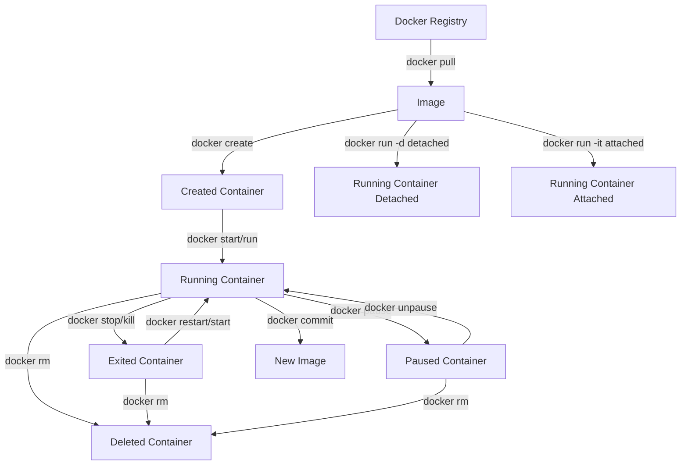

# Docker สำหรับการพัฒนาเว็บแอปพลิเคชันแบบฟุลสแตกเพื่อให้สภาพแวดล้อมในการพัฒนา สามารถส่งมอบ (Deploy) ได้อย่างมีประสิทธิภาพ
## คำอธิบาย
แบบฝึกปฏิบัตินี้ ใช้สำหรับรายวิชา ทนด. 201 ทักษะการพัฒนาซอฟต์แวร์แบบฟุลสแตก ภาคเรียนที่ 2/2567 เพื่อฝึกทักษะการสร้างสภาพแวดล้อมสำหรับพัฒนาซอฟต์แวร์ด้วย Docker สามารถนำเว็บแอปพลิเคชันแบบฟุลสแตกที่ใช้ React (Frontend) และ Node.js/Express (Backend) มาสร้างเป็นคอนเทนเนอร์เพื่อประสิทธิภาพในการ
## ประเด็นสำคัญที่ครอบคลุม
- *การสร้างสภาพแวดล้อมในการพัฒนาโปรแกรมด้วย Docker* เรียนรู้วิธีการติดตั้ง Docker Desktop, เชื่อมต่อกับ Docker Hub, กำหนดค่า Docker เพื่อรองรับการพัฒนาแบบ SPA ด้วย Vite และ React
-*ประเด็นสำคัญของสภาพแวดล้อมใน Docker Container*
-  *การสร้าง Container สำหรับ Backend* การสร้าง Docker container สำหรับ REST API ที่พัฒนาด้วย Node.js และ Express
- *Multi-container environment* การเชื่อมต่อคอนเทนเนอร์หลายตัวที่ทำงานร่วมกันเช่น Frontend, Backend และฐานข้อมูล PostgreSQL
- *การใช้ Docker กับ CI/CD Pipeline* การใช้ Docker ร่วมกับ GitHub Actions เพื่อการ automated testing และ deployment
- *การ Optimize Docker images* เทคนิคการสร้าง Docker image ที่มีประสิทธิภาพสำหรับการใช้งานในสภาพแวดล้อมจริง

# เล่าเรื่อง Continuous Delivery - วิธีการส่งมอบซอฟต์แวร์ ในลักษณะที่แอปใช้งานได้ต่อเนื่อง
![[CD-RelationshipMap-Th.png]]
ในอดีต การพัฒนาซอฟต์แวร์เป็นเหมือนการเดินทางที่ยาวนานและเต็มไปด้วยอุปสรรค เมื่อนักพัฒนาเขียนโค้ดเสร็จ พวกเขาต้องส่งต่องานไปยังทีม QA เพื่อทดสอบ ซึ่งอาจใช้เวลาหลายสัปดาห์หรือแม้กระทั่งหลายเดือน จากนั้นงานจะถูกส่งต่อไปยังทีมปฏิบัติการเพื่อนำขึ้นระบบจริง กระบวนการนี้มักเต็มไปด้วยความล่าช้า ความเสี่ยง และความผิดพลาด ลูกค้าต้องรอนานกว่าจะได้ใช้ฟีเจอร์ใหม่ และเมื่อพบข้อผิดพลาด การแก้ไขก็ต้องผ่านวงจรอันยาวนานนี้อีกครั้ง

แต่แล้ววันหนึ่ง แนวคิดใหม่ที่เรียกว่า Continuous Delivery หรือ CD ก็เกิดขึ้น เปรียบเสมือนการปฏิวัติในวงการพัฒนาซอฟต์แวร์ แทนที่จะแบ่งงานออกเป็นสามขั้นตอนแยกกันอย่างชัดเจน CD ได้นำเอาทั้งสามขั้นตอนมารวมกันในรูปแบบของ "ไปป์ไลน์การปรับใช้อัตโนมัติ" ที่ทำงานโดยอัตโนมัติหลังจากที่มีการเปลี่ยนแปลงโค้ด ไม่ว่าจะเป็นการเพิ่มฟีเจอร์ใหม่ การแก้ไขบัก หรือการเปลี่ยนแปลงการตั้งค่า

เรื่องราวของ Flickr และ Yahoo! เป็นตัวอย่างที่ดีของการเปลี่ยนแปลงนี้ เมื่อ Yahoo! ซื้อ Flickr ในปี 2005 พวกเขาพบว่าตัวเองมีวัฒนธรรมการทำงานที่แตกต่างกันมาก Yahoo! ใช้กระบวนการส่งมอบแบบดั้งเดิมที่ระมัดระวังและช้า ในขณะที่ Flickr ปล่อยโค้ดขึ้นระบบจริงหลายครั้งต่อวัน Yahoo! มองว่าวิธีการของ Flickr เป็นเรื่องอันตรายและไร้ความรับผิดชอบ แต่เมื่อพวกเขาประเมินความน่าเชื่อถือของระบบ พวกเขาพบว่า Flickr มีเวลาดาวน์ไทม์น้อยที่สุดในบรรดาผลิตภัณฑ์ทั้งหมดของ Yahoo! นี่เป็นบทเรียนสำคัญที่แสดงให้เห็นว่าการปล่อยซอฟต์แวร์บ่อยๆ ในชุดการเปลี่ยนแปลงเล็กๆ นั้นปลอดภัยกว่าการปล่อยครั้งใหญ่แต่นานๆ ครั้ง

การนำ CD มาใช้ไม่ใช่เรื่องง่าย มันต้องการการเปลี่ยนแปลงทั้งในด้านองค์กรและเทคนิค องค์กรต้องสร้างวัฒนธรรม DevOps ที่ทีมพัฒนา QA และปฏิบัติการทำงานร่วมกันอย่างใกล้ชิด ลูกค้าต้องมีส่วนร่วมในการเขียนการทดสอบการยอมรับ และทีมต้องลงทุนในการทำให้ทุกขั้นตอนเป็นอัตโนมัติ ตั้งแต่การบิลด์ การทดสอบ ไปจนถึงการปรับใช้

แนวคิดสำคัญอีกประการหนึ่งที่มาพร้อมกับ CD คือรูปแบบการทดสอบที่เหมาะสม พีระมิดการทดสอบแนะนำให้มีการทดสอบหน่วยจำนวนมากที่ฐาน การทดสอบบูรณาการที่ระดับกลาง และการทดสอบ UI จำนวนน้อยที่ยอด เมทริกซ์การทดสอบแบบอไจล์แบ่งการทดสอบออกเป็นประเภทต่างๆ ตามวัตถุประสงค์และมุมมอง ทั้งสองแนวคิดนี้ช่วยทีมในการวางแผนและจัดลำดับความสำคัญของความพยายามในการทดสอบของพวกเขา

ในปัจจุบัน CD ได้กลายเป็นวิธีปฏิบัติมาตรฐานสำหรับองค์กรชั้นนำหลายแห่ง บริษัทเช่น Amazon, Google และ Netflix ทำการปล่อยซอฟต์แวร์หลายพันครั้งต่อวัน แม้แต่องค์กรที่มีสถาปัตยกรรมไมโครเซอร์วิสก็พบว่า CD เป็นประโยชน์ โดยสามารถมีไปป์ไลน์ CD แยกต่างหากสำหรับแต่ละเซอร์วิส ทำให้ทีมสามารถปรับใช้บริการของตนได้อย่างอิสระโดยไม่กระทบกับส่วนอื่นๆ ของระบบ

ประโยชน์ของ CD นั้นมีมากมาย นักพัฒนาได้รับข้อมูลย้อนกลับเร็วขึ้น ลูกค้าได้รับฟีเจอร์ใหม่เร็วขึ้น การปล่อยซอฟต์แวร์มีความเสี่ยงน้อยลง และองค์กรมีความยืดหยุ่นมากขึ้นในการตอบสนองต่อความต้องการของตลาด เรื่องราวของ Continuous Delivery ไม่ใช่แค่เรื่องของเทคโนโลยี แต่เป็นเรื่องของการเปลี่ยนแปลงวิธีคิดเกี่ยวกับการพัฒนาซอฟต์แวร์ จากกระบวนการที่ช้าและเสี่ยง สู่กระบวนการที่รวดเร็ว ยืดหยุ่น และน่าเชื่อถือมากขึ้น
# แนวคิดเกี่ยวกับ Docker

## ผังแสดงสถานะของ Docker Image and Containers

